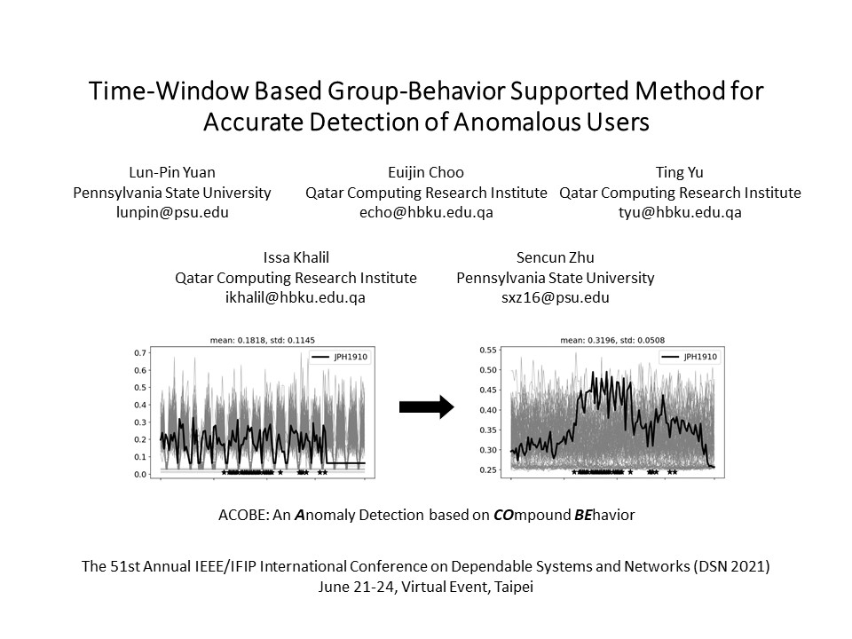
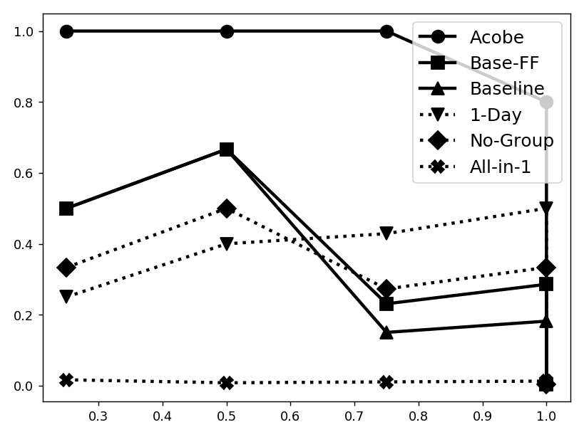
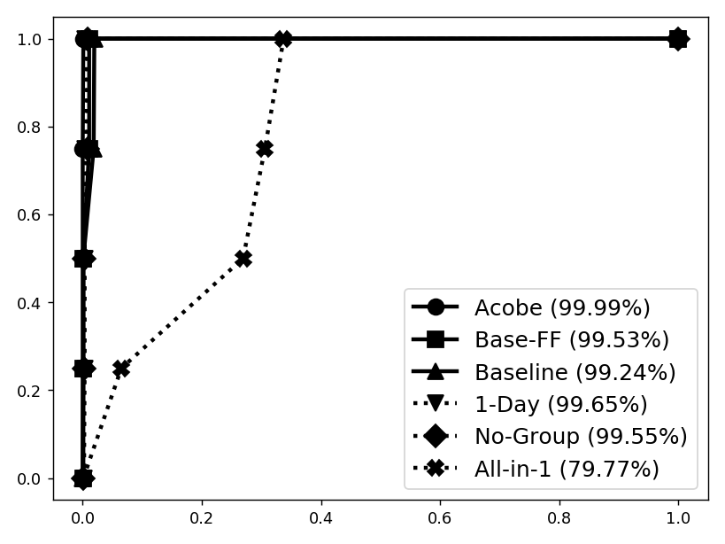
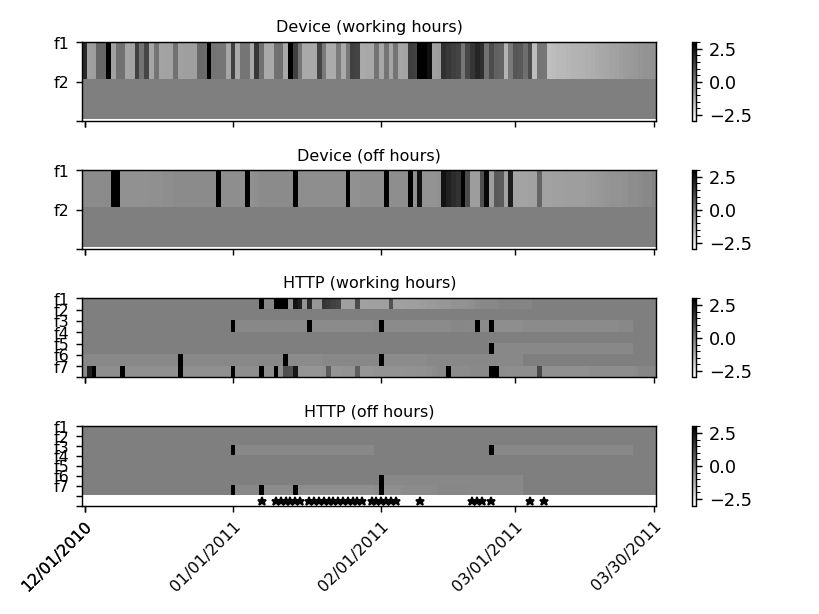
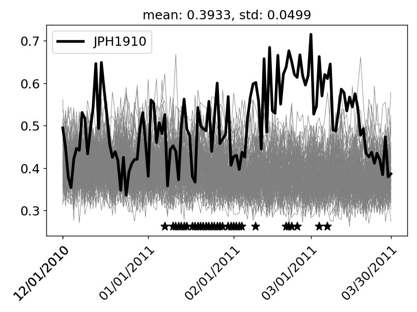
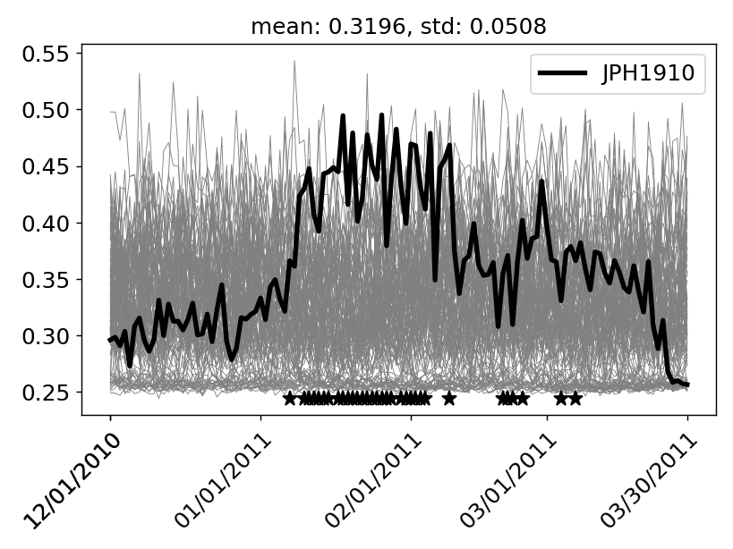
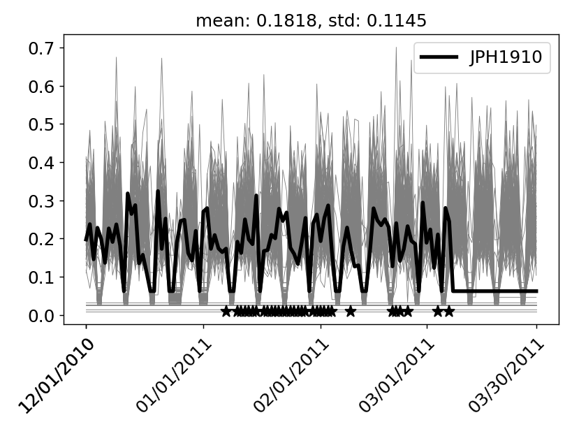

# Acobe

Acobe: An ***A***nomaly Detection Method Based on ***CO***mpound ***BE***havior

Lun-Pin Yuan, Euijin Choo, Ting Yu, Issa Khalil, and Sencun Zhu. 2021. Time-Window Based Group-Behavior Supported Method for Accurate Detection of Anomalous Users. In Proceedings of the 2021 51th Annual IEEE/IFIP International Conference on Dependable Systems and Networks (DSN), June 21-24, 2021, Virtual Event, Taipei.

[https://arxiv.org/abs/2012.13971](https://arxiv.org/abs/2012.13971)



# System Requirement

This project was developed on ***BIZON G3000 – 2-4 GPU Deep Learning Workstation PC*** (spec listed below).  This project requires ***64 GB memory***, or it may crash during runtime.  It took *1-2 hours* to run a single executation (i.e., *exp-unswnb15.py* and *exp-sosp2009.py*).  A single execution includes training, testing, and generating evaluation metrics, but not preprocessing and plotting.

| Spec          | Description                                                  |
| ------------- | ------------------------------------------------------------ |
| Processor     | Skylake X; 8-Core 3.80 GHz Intel Core i7-9800X               |
| Memory        | DDR4 3000MHz 64 GB (4 x 16 GB)                               |
| Graphics Card | 2 x NVIDIA RTX 2080 8 GB with 1 x NVLink Bridge              |
| System        | Ubuntu 18.04 Bionic (not using Bizon's preinstalled package) |
| Environment   | Python 3.7.4, Tensorflow 2.0.0, and Anaconda 4.7.12          |

# Dataset

The ***data*** folder provides a few preprocessed data examples.  For full dataset, please find them from the links below. 

| Name      | Content | Link |
| --------- | ------- | ---- |
| CERT 2016 | Insider Threat | [https://resources.sei.cmu.edu/library/asset-view.cfm?assetid=508099](https://resources.sei.cmu.edu/library/asset-view.cfm?assetid=508099) <br> [https://doi.org/10.1184/R1/12841247.v1](https://doi.org/10.1184/R1/12841247.v1) |

Please preprocess the dataset by running the following commands.  Please check *-h* for flag options.

```
python3 exp-cert2016.py parse 
python3 exp-cert2016.py genbh
python3 exp-cert2016.py label
```

# Execution Examples

Please use flags if needed.  For example, to specificy input directory, use *-i /data/cert2016/data*.  Please use *-h* for flag options.

## r6.1

```
# Acobe

time exp-cert2016.py behad -o expbeh/2020-03-07_s1beh_1 -l anom1_labeledldap.txt --use-gpu 0 -g 2 --train-start 01/02/2010 --train-end 11/30/2010 --test-start 12/01/2010 --test-end 03/30/2011 -m ae1 --beh-window 30 --beh-feature device-connect device-newevent --beh-weight 3 ;\
time exp-cert2016.py behad -o expbeh/2020-03-07_s1beh_2 -l anom1_labeledldap.txt --use-gpu 0 -g 2 --train-start 01/02/2010 --train-end 11/30/2010 --test-start 12/01/2010 --test-end 03/30/2011 -m ae1 --beh-window 30 --beh-feature "file-activity-file open" "file-activity-file copy" "file-activity-file write" file-newevent --beh-weight 3 ;\
time exp-cert2016.py behad -o expbeh/2020-03-07_s1beh_3 -l anom1_labeledldap.txt --use-gpu 0 -g 2 --train-start 01/02/2010 --train-end 11/30/2010 --test-start 12/01/2010 --test-end 03/30/2011 -m ae1 --beh-window 30 --beh-feature "http-activity-www upload" http-newevent --beh-weight 3 ;\

time exp-cert2016.py behad -o expbeh/2020-03-07_s2beh_1 -l anom2_labeledldap.txt --use-gpu 0 -g 2 --train-start 01/02/2010 --train-end 03/31/2011 --test-start 04/01/2011 --test-end 06/30/2011 -m ae1 --beh-window 30 --beh-weight 3  --beh-feature device-connect device-newevent ;\
time exp-cert2016.py behad -o expbeh/2020-03-07_s2beh_2 -l anom2_labeledldap.txt --use-gpu 0 -g 2 --train-start 01/02/2010 --train-end 03/31/2011 --test-start 04/01/2011 --test-end 06/30/2011 -m ae1 --beh-window 30 --beh-weight 3  --beh-feature "file-activity-file open" "file-activity-file copy" "file-activity-file write" file-newevent ;\
time exp-cert2016.py behad -o expbeh/2020-03-07_s2beh_4 -l anom2_labeledldap.txt --use-gpu 0 -g 2 --train-start 01/02/2010 --train-end 03/31/2011 --test-start 04/01/2011 --test-end 06/30/2011 -m ae1 --beh-window 30 --beh-weight 3  --beh-feature email-internal ;\

time exp-cert2016.py behad -o expbeh/2020-03-07_s3beh_1 -l anom3_labeledldap.txt --use-gpu 0 -g 2 --train-start 01/02/2010 --train-end 08/31/2010 --test-start 09/01/2010 --test-end 11/30/2010 -m ae1 --beh-window 30 --beh-weight 3  --beh-feature device-connect device-newevent ;\
time exp-cert2016.py behad -o expbeh/2020-03-07_s3beh_2 -l anom3_labeledldap.txt --use-gpu 0 -g 2 --train-start 01/02/2010 --train-end 08/31/2010 --test-start 09/01/2010 --test-end 11/30/2010 -m ae1 --beh-window 30 --beh-weight 3  --beh-feature "file-activity-file open" "file-activity-file copy" "file-activity-file write" file-newevent ;\
time exp-cert2016.py behad -o expbeh/2020-03-07_s3beh_4 -l anom3_labeledldap.txt --use-gpu 0 -g 2 --train-start 01/02/2010 --train-end 08/31/2010 --test-start 09/01/2010 --test-end 11/30/2010 -m ae1 --beh-window 30 --beh-weight 3  --beh-feature email-internal ;\


# Exclude group behavior from heatmaps (--beh-nogroupbeh)

time exp-cert2016.py behad -o expbeh/2020-04-04_s1beh_1 -l anom1_labeledldap.txt --use-gpu 0 -g 2 --train-start 01/02/2010 --train-end 11/30/2010 --test-start 12/01/2010 --test-end 03/30/2011 -m ae1 --beh-window 30 --beh-weight 3  --beh-feature device-connect device-newevent --beh-nogroupbeh ;\
time exp-cert2016.py behad -o expbeh/2020-04-04_s1beh_2 -l anom1_labeledldap.txt --use-gpu 0 -g 2 --train-start 01/02/2010 --train-end 11/30/2010 --test-start 12/01/2010 --test-end 03/30/2011 -m ae1 --beh-window 30 --beh-weight 3  --beh-feature "file-activity-file open" "file-activity-file copy" "file-activity-file write" file-newevent --beh-nogroupbeh  ;\
time exp-cert2016.py behad -o expbeh/2020-04-04_s1beh_3 -l anom1_labeledldap.txt --use-gpu 0 -g 2 --train-start 01/02/2010 --train-end 11/30/2010 --test-start 12/01/2010 --test-end 03/30/2011 -m ae1 --beh-window 30 --beh-weight 3  --beh-feature "http-activity-www upload" http-newevent --beh-nogroupbeh  ;\

# Divide a day into four slices (--beh-slice 24)

time exp-cert2016.py behad -o expbeh/2020-04-05_s1beh_1 -l anom1_labeledldap.txt --use-gpu 0 -g 2 --train-start 01/02/2010 --train-end 11/30/2010 --test-start 12/01/2010 --test-end 03/30/2011 -m ae1 --beh-window 30 --beh-weight 3  --beh-feature device-connect device-newevent --beh-slice 24 ;\
time exp-cert2016.py behad -o expbeh/2020-04-05_s1beh_2 -l anom1_labeledldap.txt --use-gpu 0 -g 2 --train-start 01/02/2010 --train-end 11/30/2010 --test-start 12/01/2010 --test-end 03/30/2011 -m ae1 --beh-window 30 --beh-weight 3  --beh-feature "file-activity-file open" "file-activity-file copy" "file-activity-file write" file-newevent --beh-slice 24 ;\
time exp-cert2016.py behad -o expbeh/2020-04-05_s1beh_3 -l anom1_labeledldap.txt --use-gpu 0 -g 2 --train-start 01/02/2010 --train-end 11/30/2010 --test-start 12/01/2010 --test-end 03/30/2011 -m ae1 --beh-window 30 --beh-weight 3  --beh-feature "http-activity-www upload" http-newevent --beh-slice 24 ;\

# All in one autoencoder

time exp-cert2016.py behad -l  anom1_labeledldap.txt --use-gpu 0 -g 2 --train-start 01/02/2010 --train-end 11/30/2010 --test-start 12/01/2010 --test-end 03/30/2011 -o expbeh/2020-02-15_s1beh_16 -m ae1 --beh-feature device-connect device-newevent "file-activity-file open" "file-activity-file copy" "file-activity-file write" file-newevent "http-activity-www upload" http-newevent --beh-window 30 --beh-weight 3  ;

# Single-day reconstruction

time exp-cert2016.py behad -o expbeh/2020-05-27_s1beh_1 -l anom1_labeledldap.txt --use-gpu 0 -g 2 --train-start 01/02/2010 --train-end 11/30/2010 --test-start 12/01/2010 --test-end 03/30/2011 -m ae1 --beh-window 1 --beh-weight 3  --beh-feature device-connect device-newevent  ;\
time exp-cert2016.py behad -o expbeh/2020-05-27_s1beh_2 -l anom1_labeledldap.txt --use-gpu 0 -g 2 --train-start 01/02/2010 --train-end 11/30/2010 --test-start 12/01/2010 --test-end 03/30/2011 -m ae1 --beh-window 1 --beh-weight 3  --beh-feature "file-activity-file open" "file-activity-file copy" "file-activity-file write" file-newevent  ;\
time exp-cert2016.py behad -o expbeh/2020-05-27_s1beh_3 -l anom1_labeledldap.txt --use-gpu 0 -g 2 --train-start 01/02/2010 --train-end 11/30/2010 --test-start 12/01/2010 --test-end 03/30/2011 -m ae1 --beh-window 1 --beh-weight 3  --beh-feature "http-activity-www upload" http-newevent  ;\

# Baseline (--beh-window 1 --beh-slice 24 --beh-nogroupbeh & coarse-grained features) 

time exp-cert2016.py behad -o expbeh/2020-06-07_s1beh_1 -l anom1_labeledldap.txt --use-gpu 0 -g 2 --train-start 01/02/2010 --train-end 11/30/2010 --test-start 12/01/2010 --test-end 03/30/2011 -m ae1 --beh-window 1 --beh-weight 3  --beh-feature device --beh-slice 24 --beh-nogroupbeh --version liuliu ;\
time exp-cert2016.py behad -o expbeh/2020-06-07_s1beh_2 -l anom1_labeledldap.txt --use-gpu 0 -g 2 --train-start 01/02/2010 --train-end 11/30/2010 --test-start 12/01/2010 --test-end 03/30/2011 -m ae1 --beh-window 1 --beh-weight 3  --beh-feature file --beh-slice 24 --beh-nogroupbeh --version liuliu ;\
time exp-cert2016.py behad -o expbeh/2020-06-07_s1beh_3 -l anom1_labeledldap.txt --use-gpu 0 -g 2 --train-start 01/02/2010 --train-end 11/30/2010 --test-start 12/01/2010 --test-end 03/30/2011 -m ae1 --beh-window 1 --beh-weight 3  --beh-feature http --beh-slice 24 --beh-nogroupbeh --version liuliu ;\
time exp-cert2016.py behad -o expbeh/2020-06-07_s1beh_4 -l anom1_labeledldap.txt --use-gpu 0 -g 2 --train-start 01/02/2010 --train-end 11/30/2010 --test-start 12/01/2010 --test-end 03/30/2011 -m ae1 --beh-window 1 --beh-weight 3  --beh-feature logon --beh-slice 24 --beh-nogroupbeh --version liuliu ;\

# Baseline (--beh-window 1 --beh-slice 24 --beh-nogroupbeh & fine-grained features) 

time exp-cert2016.py behad -o expbeh/2020-06-08_s1beh_1 -l anom1_labeledldap.txt --use-gpu 0 -g 2 --train-start 01/02/2010 --train-end 11/30/2010 --test-start 12/01/2010 --test-end 03/30/2011 -m ae1 --beh-window 1 --beh-weight 3  --beh-feature device-connect device-newevent --beh-slice 24 --beh-nogroupbeh ;\
time exp-cert2016.py behad -o expbeh/2020-06-08_s1beh_2 -l anom1_labeledldap.txt --use-gpu 0 -g 2 --train-start 01/02/2010 --train-end 11/30/2010 --test-start 12/01/2010 --test-end 03/30/2011 -m ae1 --beh-window 1 --beh-weight 3  --beh-feature "file-activity-file open" "file-activity-file copy" "file-activity-file write" file-newevent --beh-slice 24 --beh-nogroupbeh  ;\
time exp-cert2016.py behad -o expbeh/2020-06-08_s1beh_3 -l anom1_labeledldap.txt --use-gpu 0 -g 2 --train-start 01/02/2010 --train-end 11/30/2010 --test-start 12/01/2010 --test-end 03/30/2011 -m ae1 --beh-window 1 --beh-weight 3  --beh-feature "http-activity-www upload" http-newevent --beh-slice 24 --beh-nogroupbeh ;\
```

## r6.2

```
# Acobe

time exp-cert2016.py behad -o expbeh/2020-03-07_s1beh_1 -l anom1_labeledldap.txt --use-gpu 1 -g 2 --train-start 01/02/2010 --train-end 06/30/2010 --test-start 07/01/2010 --test-end 09/30/2010 -m ae1 --beh-window 30 --beh-weight 3  --beh-feature device-connect device-newevent ;\
time exp-cert2016.py behad -o expbeh/2020-03-07_s1beh_2 -l anom1_labeledldap.txt --use-gpu 1 -g 2 --train-start 01/02/2010 --train-end 06/30/2010 --test-start 07/01/2010 --test-end 09/30/2010 -m ae1 --beh-window 30 --beh-weight 3  --beh-feature "file-activity-file open" "file-activity-file copy" "file-activity-file write" file-newevent ;\
time exp-cert2016.py behad -o expbeh/2020-03-07_s1beh_3 -l anom1_labeledldap.txt --use-gpu 1 -g 2 --train-start 01/02/2010 --train-end 06/30/2010 --test-start 07/01/2010 --test-end 09/30/2010 -m ae1 --beh-window 30 --beh-weight 3  --beh-feature "http-activity-www upload" http-newevent ;\

time exp-cert2016.py behad -o expbeh/2020-03-07_s2beh_1 -l anom2_labeledldap.txt --use-gpu 1 -g 2 --train-start 01/02/2010 --train-end 12/31/2010 --test-start 01/01/2011 --test-end 04/30/2011 -m ae1 --beh-window 30 --beh-weight 3  --beh-feature device-connect device-newevent ;\
time exp-cert2016.py behad -o expbeh/2020-03-07_s2beh_2 -l anom2_labeledldap.txt --use-gpu 1 -g 2 --train-start 01/02/2010 --train-end 12/31/2010 --test-start 01/01/2011 --test-end 04/30/2011 -m ae1 --beh-window 30 --beh-weight 3  --beh-feature "file-activity-file open" "file-activity-file copy" "file-activity-file write" file-newevent ;\
time exp-cert2016.py behad -o expbeh/2020-03-07_s2beh_3 -l anom2_labeledldap.txt --use-gpu 1 -g 2 --train-start 01/02/2010 --train-end 12/31/2010 --test-start 01/01/2011 --test-end 04/30/2011 -m ae1 --beh-window 30 --beh-weight 3  --beh-feature "http-activity-www upload" http-newevent ;\

time exp-cert2016.py behad -o expbeh/2020-03-07_s3beh_1 -l anom3_labeledldap.txt --use-gpu 1 -g 2 --train-start 01/02/2010 --train-end 06/30/2010 --test-start 07/01/2010 --test-end 09/30/2010 -m ae1 --beh-window 30 --beh-weight 3  --beh-feature device-connect device-newevent ;\
time exp-cert2016.py behad -o expbeh/2020-03-07_s3beh_2 -l anom3_labeledldap.txt --use-gpu 1 -g 2 --train-start 01/02/2010 --train-end 06/30/2010 --test-start 07/01/2010 --test-end 09/30/2010 -m ae1 --beh-window 30 --beh-weight 3  --beh-feature "file-activity-file open" "file-activity-file copy" "file-activity-file write" file-newevent ;\
time exp-cert2016.py behad -o expbeh/2020-03-07_s3beh_4 -l anom3_labeledldap.txt --use-gpu 1 -g 2 --train-start 01/02/2010 --train-end 06/30/2010 --test-start 07/01/2010 --test-end 09/30/2010 -m ae1 --beh-window 30 --beh-weight 3  --beh-feature email-internal ;\
time exp-cert2016.py behad -o expbeh/2020-03-07_s4beh_2 -l anom4_labeledldap.txt --use-gpu 1 -g 2 --train-start 01/02/2010 --train-end 12/31/2010 --test-start 01/01/2011 --test-end 05/31/2011 -m ae1 --beh-window 30 --beh-weight 3  --beh-feature "file-activity-file open" "file-activity-file copy" "file-activity-file write" file-newevent ;\
time exp-cert2016.py behad -o expbeh/2020-03-07_s4beh_5 -l anom4_labeledldap.txt --use-gpu 1 -g 2 --train-start 01/02/2010 --train-end 12/31/2010 --test-start 01/01/2011 --test-end 05/31/2011 -m ae1 --beh-window 30 --beh-weight 3  --beh-feature email-external ;\
time exp-cert2016.py behad -o expbeh/2020-03-07_s4beh_6 -l anom4_labeledldap.txt --use-gpu 1 -g 2 --train-start 01/02/2010 --train-end 12/31/2010 --test-start 01/01/2011 --test-end 05/31/2011 -m ae1 --beh-window 30 --beh-weight 3  --beh-feature logon ;\

# Exclude group behavior from heatmaps (--beh-nogroupbeh)

time exp-cert2016.py behad -o expbeh/2020-04-04_s1beh_1 -l anom1_labeledldap.txt --use-gpu 1 -g 2 --train-start 01/02/2010 --train-end 06/30/2010 --test-start 07/01/2010 --test-end 09/30/2010 -m ae1 --beh-window 30 --beh-weight 3  --beh-feature device-connect device-newevent --beh-nogroupbeh ;\
time exp-cert2016.py behad -o expbeh/2020-04-04_s1beh_2 -l anom1_labeledldap.txt --use-gpu 1 -g 2 --train-start 01/02/2010 --train-end 06/30/2010 --test-start 07/01/2010 --test-end 09/30/2010 -m ae1 --beh-window 30 --beh-weight 3  --beh-feature "file-activity-file open" "file-activity-file copy" "file-activity-file write" file-newevent --beh-nogroupbeh ;\
time exp-cert2016.py behad -o expbeh/2020-04-04_s1beh_3 -l anom1_labeledldap.txt --use-gpu 1 -g 2 --train-start 01/02/2010 --train-end 06/30/2010 --test-start 07/01/2010 --test-end 09/30/2010 -m ae1 --beh-window 30 --beh-weight 3  --beh-feature "http-activity-www upload" http-newevent --beh-nogroupbeh ;\

time exp-cert2016.py behad -o expbeh/2020-04-04_s2beh_1 -l anom2_labeledldap.txt --use-gpu 1 -g 2 --train-start 01/02/2010 --train-end 12/31/2010 --test-start 01/01/2011 --test-end 04/30/2011 -m ae1 --beh-window 30 --beh-weight 3  --beh-feature device-connect device-newevent --beh-nogroupbeh ;\
time exp-cert2016.py behad -o expbeh/2020-04-04_s2beh_2 -l anom2_labeledldap.txt --use-gpu 1 -g 2 --train-start 01/02/2010 --train-end 12/31/2010 --test-start 01/01/2011 --test-end 04/30/2011 -m ae1 --beh-window 30 --beh-weight 3  --beh-feature "file-activity-file open" "file-activity-file copy" "file-activity-file write" file-newevent --beh-nogroupbeh ;\
time exp-cert2016.py behad -o expbeh/2020-04-04_s2beh_3 -l anom2_labeledldap.txt --use-gpu 1 -g 2 --train-start 01/02/2010 --train-end 12/31/2010 --test-start 01/01/2011 --test-end 04/30/2011 -m ae1 --beh-window 30 --beh-weight 3  --beh-feature "http-activity-www upload" http-newevent --beh-nogroupbeh ;\

# Divide a day into 24 slices (--beh-slice 24)

time exp-cert2016.py behad -o expbeh/2020-04-05_s1beh_1 -l anom1_labeledldap.txt --use-gpu 1 -g 2 --train-start 01/02/2010 --train-end 06/30/2010 --test-start 07/01/2010 --test-end 09/30/2010 -m ae1 --beh-window 30 --beh-weight 3  --beh-feature device-connect device-newevent --beh-slice 24 ;\
time exp-cert2016.py behad -o expbeh/2020-04-05_s1beh_2 -l anom1_labeledldap.txt --use-gpu 1 -g 2 --train-start 01/02/2010 --train-end 06/30/2010 --test-start 07/01/2010 --test-end 09/30/2010 -m ae1 --beh-window 30 --beh-weight 3  --beh-feature "file-activity-file open" "file-activity-file copy" "file-activity-file write" file-newevent --beh-slice 24  ;\
time exp-cert2016.py behad -o expbeh/2020-04-05_s1beh_3 -l anom1_labeledldap.txt --use-gpu 1 -g 2 --train-start 01/02/2010 --train-end 06/30/2010 --test-start 07/01/2010 --test-end 09/30/2010 -m ae1 --beh-window 30 --beh-weight 3  --beh-feature "http-activity-www upload" http-newevent --beh-slice 24 ;\

time exp-cert2016.py behad -o expbeh/2020-04-05_s2beh_1 -l anom2_labeledldap.txt --use-gpu 1 -g 2 --train-start 01/02/2010 --train-end 12/31/2010 --test-start 01/01/2011 --test-end 04/30/2011 -m ae1 --beh-window 30 --beh-weight 3  --beh-feature device-connect device-newevent --beh-slice 24  ;\
time exp-cert2016.py behad -o expbeh/2020-04-05_s2beh_2 -l anom2_labeledldap.txt --use-gpu 1 -g 2 --train-start 01/02/2010 --train-end 12/31/2010 --test-start 01/01/2011 --test-end 04/30/2011 -m ae1 --beh-window 30 --beh-weight 3  --beh-feature "file-activity-file open" "file-activity-file copy" "file-activity-file write" file-newevent --beh-slice 24  ;\
time exp-cert2016.py behad -o expbeh/2020-04-05_s2beh_3 -l anom2_labeledldap.txt --use-gpu 1 -g 2 --train-start 01/02/2010 --train-end 12/31/2010 --test-start 01/01/2011 --test-end 04/30/2011 -m ae1 --beh-window 30 --beh-weight 3  --beh-feature "http-activity-www upload" http-newevent --beh-slice 24 ;\

# All in one autoencoder

time exp-cert2016.py behad -l anom1_labeledldap.txt --use-gpu 1 -g 2 --train-start 01/02/2010 --train-end 11/30/2010 --test-start 12/01/2010 --test-end 03/30/2011 -o expbeh/2020-02-15_s1beh_16 -m ae1 --beh-feature device-connect device-newevent "file-activity-file open" "file-activity-file copy" "file-activity-file write" file-newevent "http-activity-www upload" http-newevent --beh-window 30 --beh-weight 3  ;\
time exp-cert2016.py behad -l anom2_labeledldap.txt --use-gpu 1 -g 2 --train-start 01/02/2010 --train-end 11/30/2010 --test-start 12/01/2010 --test-end 03/30/2011 -o expbeh/2020-02-15_s2beh_16 -m ae1 --beh-feature device-connect device-newevent "file-activity-file open" "file-activity-file copy" "file-activity-file write" file-newevent "http-activity-www upload" http-newevent --beh-window 30 --beh-weight 3  ;

# Single-day reconstruction

time exp-cert2016.py behad -o expbeh/2020-05-27_s1beh_1 -l anom1_labeledldap.txt --use-gpu 1 -g 2 --train-start 01/02/2010 --train-end 06/30/2010 --test-start 07/01/2010 --test-end 09/30/2010 -m ae1 --beh-window 1 --beh-weight 3  --beh-feature device-connect device-newevent ;\
time exp-cert2016.py behad -o expbeh/2020-05-27_s1beh_2 -l anom1_labeledldap.txt --use-gpu 1 -g 2 --train-start 01/02/2010 --train-end 06/30/2010 --test-start 07/01/2010 --test-end 09/30/2010 -m ae1 --beh-window 1 --beh-weight 3  --beh-feature "file-activity-file open" "file-activity-file copy" "file-activity-file write" file-newevent ;\
time exp-cert2016.py behad -o expbeh/2020-05-27_s1beh_3 -l anom1_labeledldap.txt --use-gpu 1 -g 2 --train-start 01/02/2010 --train-end 06/30/2010 --test-start 07/01/2010 --test-end 09/30/2010 -m ae1 --beh-window 1 --beh-weight 3  --beh-feature "http-activity-www upload" http-newevent ;\

time exp-cert2016.py behad -o expbeh/2020-05-27_s2beh_1 -l anom2_labeledldap.txt --use-gpu 1 -g 2 --train-start 01/02/2010 --train-end 12/31/2010 --test-start 01/01/2011 --test-end 04/30/2011 -m ae1 --beh-window 1 --beh-weight 3  --beh-feature device-connect device-newevent ;\
time exp-cert2016.py behad -o expbeh/2020-05-27_s2beh_2 -l anom2_labeledldap.txt --use-gpu 1 -g 2 --train-start 01/02/2010 --train-end 12/31/2010 --test-start 01/01/2011 --test-end 04/30/2011 -m ae1 --beh-window 1 --beh-weight 3  --beh-feature "file-activity-file open" "file-activity-file copy" "file-activity-file write" file-newevent ;\
time exp-cert2016.py behad -o expbeh/2020-05-27_s2beh_3 -l anom2_labeledldap.txt --use-gpu 1 -g 2 --train-start 01/02/2010 --train-end 12/31/2010 --test-start 01/01/2011 --test-end 04/30/2011 -m ae1 --beh-window 1 --beh-weight 3  --beh-feature "http-activity-www upload" http-newevent ;\

# Baseline (--beh-window 1 --beh-slice 24 --beh-nogroupbeh & coarse-grained features) 

time exp-cert2016.py behad -o expbeh/2020-06-07_s1beh_1 -l anom1_labeledldap.txt --use-gpu 1 -g 2 --train-start 01/02/2010 --train-end 06/30/2010 --test-start 07/01/2010 --test-end 09/30/2010 -m ae1 --beh-window 1 --beh-weight 3  --beh-feature device --beh-nogroupbeh --beh-slice 24 --version liuliu ;\
time exp-cert2016.py behad -o expbeh/2020-06-07_s1beh_2 -l anom1_labeledldap.txt --use-gpu 1 -g 2 --train-start 01/02/2010 --train-end 06/30/2010 --test-start 07/01/2010 --test-end 09/30/2010 -m ae1 --beh-window 1 --beh-weight 3  --beh-feature file --beh-nogroupbeh --beh-slice 24 --version liuliu ;\
time exp-cert2016.py behad -o expbeh/2020-06-07_s1beh_3 -l anom1_labeledldap.txt --use-gpu 1 -g 2 --train-start 01/02/2010 --train-end 06/30/2010 --test-start 07/01/2010 --test-end 09/30/2010 -m ae1 --beh-window 1 --beh-weight 3  --beh-feature http --beh-nogroupbeh --beh-slice 24 --version liuliu ;\
time exp-cert2016.py behad -o expbeh/2020-06-07_s1beh_4 -l anom1_labeledldap.txt --use-gpu 1 -g 2 --train-start 01/02/2010 --train-end 06/30/2010 --test-start 07/01/2010 --test-end 09/30/2010 -m ae1 --beh-window 1 --beh-weight 3  --beh-feature logon --beh-nogroupbeh --beh-slice 24 --version liuliu ;\

time exp-cert2016.py behad -o expbeh/2020-06-07_s2beh_1 -l anom2_labeledldap.txt --use-gpu 1 -g 2 --train-start 01/02/2010 --train-end 12/31/2010 --test-start 01/01/2011 --test-end 04/30/2011 -m ae1 --beh-window 1 --beh-weight 3  --beh-feature device --beh-nogroupbeh --beh-slice 24 --version liuliu ;\
time exp-cert2016.py behad -o expbeh/2020-06-07_s2beh_2 -l anom2_labeledldap.txt --use-gpu 1 -g 2 --train-start 01/02/2010 --train-end 12/31/2010 --test-start 01/01/2011 --test-end 04/30/2011 -m ae1 --beh-window 1 --beh-weight 3  --beh-feature file --beh-nogroupbeh --beh-slice 24 --version liuliu ;\
time exp-cert2016.py behad -o expbeh/2020-06-07_s2beh_3 -l anom2_labeledldap.txt --use-gpu 1 -g 2 --train-start 01/02/2010 --train-end 12/31/2010 --test-start 01/01/2011 --test-end 04/30/2011 -m ae1 --beh-window 1 --beh-weight 3  --beh-feature http --beh-nogroupbeh --beh-slice 24 --version liuliu ;\
time exp-cert2016.py behad -o expbeh/2020-06-07_s2beh_4 -l anom2_labeledldap.txt --use-gpu 1 -g 2 --train-start 01/02/2010 --train-end 12/31/2010 --test-start 01/01/2011 --test-end 04/30/2011 -m ae1 --beh-window 1 --beh-weight 3  --beh-feature logon --beh-nogroupbeh --beh-slice 24 --version liuliu ;\

# Baseline (--beh-window 1 --beh-slice 24 --beh-nogroupbeh & fine-grained features) 

time exp-cert2016.py behad -o expbeh/2020-06-08_s1beh_1 -l anom1_labeledldap.txt --use-gpu 1 -g 2 --train-start 01/02/2010 --train-end 06/30/2010 --test-start 07/01/2010 --test-end 09/30/2010 -m ae1 --beh-window 1 --beh-weight 3  --beh-feature device-connect device-newevent --beh-slice 24 --beh-nogroupbeh  ;\
time exp-cert2016.py behad -o expbeh/2020-06-08_s1beh_2 -l anom1_labeledldap.txt --use-gpu 1 -g 2 --train-start 01/02/2010 --train-end 06/30/2010 --test-start 07/01/2010 --test-end 09/30/2010 -m ae1 --beh-window 1 --beh-weight 3  --beh-feature "file-activity-file open" "file-activity-file copy" "file-activity-file write" file-newevent --beh-slice 24 --beh-nogroupbeh   ;\
time exp-cert2016.py behad -o expbeh/2020-06-08_s1beh_3 -l anom1_labeledldap.txt --use-gpu 1 -g 2 --train-start 01/02/2010 --train-end 06/30/2010 --test-start 07/01/2010 --test-end 09/30/2010 -m ae1 --beh-window 1 --beh-weight 3  --beh-feature "http-activity-www upload" http-newevent --beh-slice 24 --beh-nogroupbeh  ;\

time exp-cert2016.py behad -o expbeh/2020-06-08_s2beh_1 -l anom2_labeledldap.txt --use-gpu 1 -g 2 --train-start 01/02/2010 --train-end 12/31/2010 --test-start 01/01/2011 --test-end 04/30/2011 -m ae1 --beh-window 1 --beh-weight 3  --beh-feature device-connect device-newevent --beh-slice 24 --beh-nogroupbeh  ;\
time exp-cert2016.py behad -o expbeh/2020-06-08_s2beh_2 -l anom2_labeledldap.txt --use-gpu 1 -g 2 --train-start 01/02/2010 --train-end 12/31/2010 --test-start 01/01/2011 --test-end 04/30/2011 -m ae1 --beh-window 1 --beh-weight 3  --beh-feature "file-activity-file open" "file-activity-file copy" "file-activity-file write" file-newevent --beh-slice 24 --beh-nogroupbeh  ;\
time exp-cert2016.py behad -o expbeh/2020-06-08_s2beh_3 -l anom2_labeledldap.txt --use-gpu 1 -g 2 --train-start 01/02/2010 --train-end 12/31/2010 --test-start 01/01/2011 --test-end 04/30/2011 -m ae1 --beh-window 1 --beh-weight 3  --beh-feature "http-activity-www upload" http-newevent --beh-slice 24 --beh-nogroupbeh ;\
```

## Plot and Analysis

The ***paper*** folder provides the scripts we used when writing our paper.  The ***paper*** folder includes plotter scripts.  Please modify the directory paths before use.  

```
python3 paper/plot-cert2016.py
```

| Precision-Recall Curve | ROC Curve | Compound Behavior |
| ---------------------- | --------- | ----------------- |
|  |  |  | 

| Acobe-Device | Acobe-HTTP | Baseline |
| ---------------------- | --------- | ----------------- |
|  |  |  | 

# Misc 

There are a few un-used code and un-used parameters.  They are our undergoing work.  I would suggest not to alter them, but feel free to explore.  Happy hacking!
